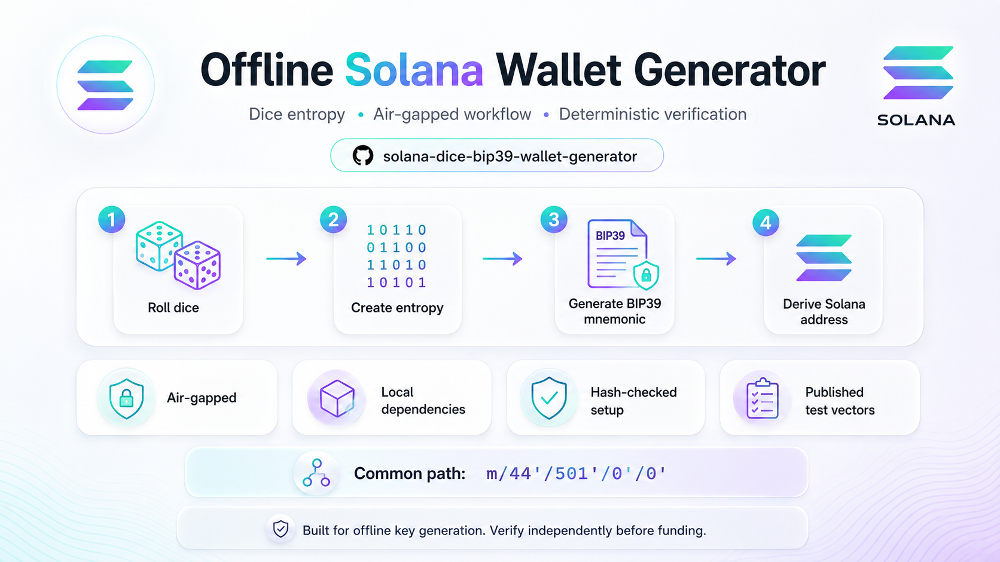
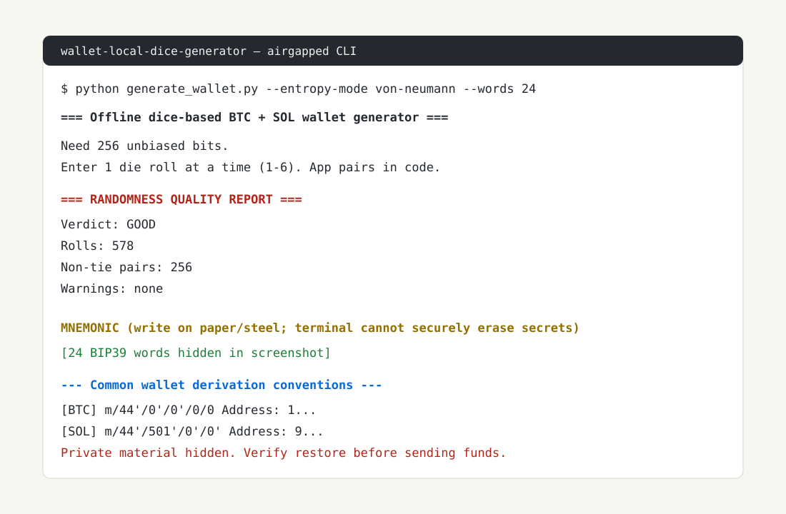

# Solana Dice BIP39 Wallet Generator



Offline Solana wallet generator from physical dice entropy.



## Security model

Helps with:

- Local Solana key generation without browser wallet-provider keygen.
- Physical dice entropy.
- Von Neumann debiasing by default.
- Pinned local wheel dependencies.
- Published BIP39, SLIP-0010, Base58, and Solana golden-vector tests.

Does not solve:

- Compromised OS/firmware/peripherals.
- RAM/swap/hibernation/crash-dump leakage.
- Bad/fake dice.
- Human backup mistakes.
- Secure zeroization of Python strings.

The complete dice-roll transcript is secret key material, especially in hash-rolls mode. Never photograph, save, print, log, or retain it.

## Defaults

- 24-word BIP39 mnemonic.
- Conservative entropy mode: `von-neumann`.
- Hash-rolls mode minimum/default: 150 physical d6 rolls for 24 words.
- Generation aborts if statistical checks detect an anomaly.
- BIP39 passphrase default: none, matching common Phantom/Solflare mnemonic-only recovery.
- BIP39 passphrase is advanced opt-in via `--bip39-passphrase`; only use it after proving your restore wallet supports mnemonic + passphrase.
- Solana paths only:
  - `m/44'/501'/0'/0'`
  - `m/44'/501'/1'/0'`

## Setup and run

On the air-gapped Windows machine:

```bat
setup_env.bat
.venv\Scripts\python.exe -I generate_wallet.py
```

Hash-rolls mode:

```bat
.venv\Scripts\python.exe -I generate_wallet.py --entropy-mode hash-rolls --roll-count 150
```

Bad dice report:

```bat
.venv\Scripts\python.exe -I generate_wallet.py --bad-dice-report --color always
```

## BIP39 passphrase compatibility

By default, this tool uses no BIP39 passphrase. That matches common Phantom/Solflare recovery flows that ask for only the 12/24 words.

A BIP39 passphrase changes the seed completely. The same words with a passphrase produce different Solana addresses. This wallet requires BOTH the mnemonic and the exact BIP39 passphrase for recovery. A wallet that does not support BIP39 passphrase entry will derive different addresses. Do not fund a passphrase-derived wallet unless you have independently restored the same address in software that explicitly supports BIP39 passphrase + the same derivation path.

Use passphrase mode only if you have tested the full restore path:

```bat
.venv\Scripts\python.exe -I generate_wallet.py --bip39-passphrase
```

## Dependency enforcement

Setup is separate from wallet generation:

1. `setup_env.bat` requires 64-bit CPython 3.10 because bundled wheels target cp310/win_amd64.
2. `setup_env.bat` refuses missing `pkgs/` and installs only with:
   - `--no-index`
   - `--find-links=./pkgs`
   - `--require-hashes`
3. `generate_wallet.py` performs zero package installation; wallet generation performs zero package installation.
4. At wallet-generation startup, it verifies:
   - `requirements-hashes.txt`
   - local wheel SHA256 hashes
   - installed package versions

## Verification

```bash
python -m unittest discover -v -s . -p 'test*.py'
```

CI runs these tests on every push/PR.

Current tests cover:

- BIP39 official mnemonic + seed vector.
- SLIP-0010 official ed25519 vector.
- End-to-end Solana golden vector for `m/44'/501'/0'/0'`.
- Base58 known vector.
- Hash-roll quality reporting regression.
- Runtime no-install regression.
- Safe hash-roll minimum.
- Suspect entropy abort.
- Hidden mnemonic gap check.
- Offline setup script behavior.

## Recommended ceremony

1. Fresh offline machine.
2. Install only from local `pkgs/` via `setup_env.bat`.
3. Roll physical dice yourself.
4. Do not retain dice transcript.
5. Write mnemonic/passphrase on paper or steel only.
6. Record derivation path and first address.
7. Restore independently in Phantom/Solflare before funding.
8. Send tiny test deposit first.

## License

MIT. See `LICENSE`.
